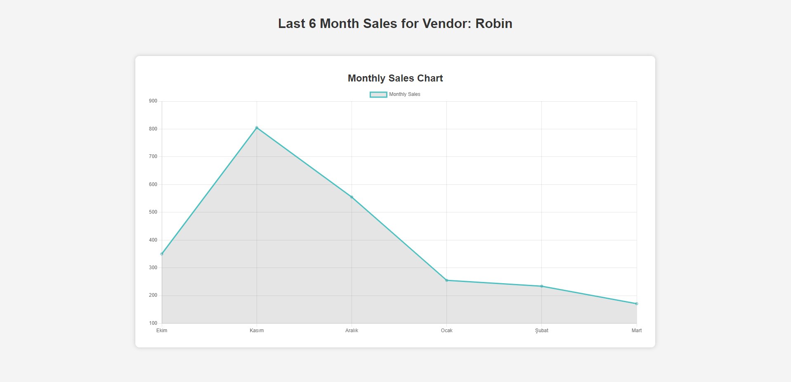
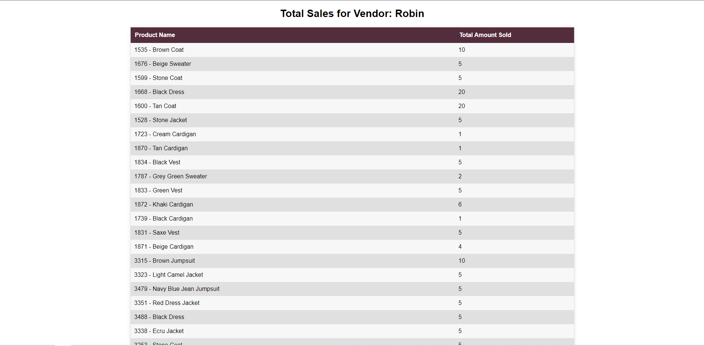

# Backend for Supplier-Dashboard

This is the backend for supplier dashboard that creates api requests to calculate monthly sales and total sales for vendors.

## Getting Started

These instructions will help you get a copy of the backend up and running on your local machine for development and testing purposes.

### Prerequisites

Before you begin, ensure you have met the following requirements:

- Node.js: Make sure you have Node.js installed on your machine. You can download it from [https://nodejs.org/](https://nodejs.org/).

### Installing

Follow these steps to get the backend running:

1. Clone the repository to your local machine:

   ```bash
   git clone <repository-url>

2. Change into the project directory:

    `cd backend`
   
3. Install the project dependencies using npm:

   `npm install express dotenv fs-extra mongoose`

4. Importing data files to database using node:

   `node data/import-data.js --import`

5. Running the Server
To start the backend server, run the following command:

   `node index.js`

The server will start on port `localhost:/8000` by default.

Built With
`Node.js`
`Express.js`
`MongoDB`


# Frontend for Supplier-Dashboard

This is the frontend to display monthly sales graph and total sales table of a vendor. 

## Getting Started

These instructions will help you get a copy of the frontend up and running on your local machine for development and testing purposes.

### Prerequisites

Before you begin, ensure you have met the following requirements:

- Node.js: Make sure you have Node.js installed on your machine. You can download it from [https://nodejs.org/](https://nodejs.org/).

### Installing

Follow these steps to get the backend running:

1. Clone the repository to your local machine:

   ```bash
   `git clone <repository-url>`

2. Change into the project directory:

    `cd frontend`

3. Install the project dependencies using npm:

`npm install react-router-dom chart.js react-chartjs-2 `

4. Running the Server
To start the backend server, run the following command:

`npm start`

The server will start on port `localhost:/3000` by default.
To display Total Sales Table, head to `http://localhost:3000/sales/${vendorId}`
To display Monthly Sales Graph, head to `http://localhost:3000/sales/monthly/${vendorId}`

Example Screenshots for the Supplier-Dashboard




Built With
`React`

This project was bootstrapped with [Create React App](https://github.com/facebook/create-react-app).
